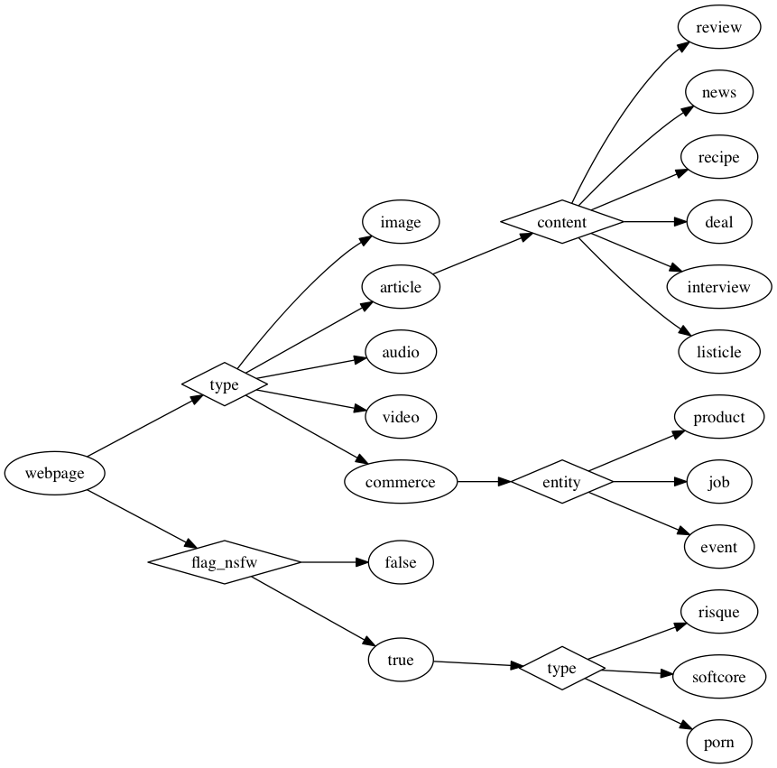

# Prismatic Interest Graph API

Table of Contents
=================

  * [Prismatic Interest Graph API](#prismatic-interest-graph-api)
  * [Table of Contents](#table-of-contents)
    * [What does this do?](#what-does-this-do)
      * [Topic Tagging](#topic-tagging)
      * [Topic Similarity](#topic-similarity)
      * [Aspect Tagging](#aspect-tagging)
    * [Is the service still in ALPHA?](#is-the-service-still-in-alpha)
    * [How do I use the service?](#how-do-i-use-the-service)
      * [Step 1: Acquire an access token](#step-1-acquire-an-access-token)
      * [Step 2: Make a query](#step-2-make-a-query)
      * [Step 3: Interpret the response](#step-3-interpret-the-response)
    * [What are the API endpoints?](#what-are-the-api-endpoints)
      * [Tag URL with Interests](#tag-url-with-interests)
        * [Input (request JSON body)](#input-request-json-body)
        * [Response](#response)
      * [Tag Text with Interests](#tag-text-with-interests)
        * [Input (request JSON body)](#input-request-json-body-1)
        * [Response](#response-1)
      * [Tag URL with Aspects](#tag-url-with-aspects)
        * [Input (request JSON body)](#input-request-json-body-2)
        * [Response](#response-2)
      * [Search for an Interest](#search-for-an-interest)
        * [Parameters](#parameters)
        * [Response](#response-3)
      * [Search for Topics Related to a Given Topic](#search-for-topics-related-to-a-given-topic)
        * [Parameters](#parameters-1)
        * [Response](#response-4)
    * [I think the system made a mistake, where can I report it?](#i-think-the-system-made-a-mistake-where-can-i-report-it)
    * [Do you have the topic I care about?](#do-you-have-the-topic-i-care-about)
    * [What aspects do you currently model?](#what-aspects-do-you-currently-model)
    * [You don’t currently model my interest. Where can I submit a request for you to model a new interest?](#you-dont-currently-model-my-interest-where-can-i-submit-a-request-for-you-to-model-a-new-interest)
    * [My question is not listed here.](#my-question-is-not-listed-here)

##What does this do?

###Topic Tagging
This service automatically analyzes the content of a document or piece of text
and reports the interests present in the article. An interest is a
non-hierarchical, single-phrase summary of the thematic content of a piece of
text; examples include *Functional Programming*, *Celebrity Gossip*, or
*Flowers*. At Prismatic, we’ve been using interests to automatically analyze
the content of text in order to help connect people with the content they find
interesting. Our interest graph can automatically analyze a piece of text and
determine which interests it is about.

###Topic Similarity
The service provides an endpoint for returning the set of topics that are similar to a given query topic.

###Aspect Tagging
This service automatically analyzes the content of a webpage, analyzes the DOM,
and reports the aspects, which describe the structure or function of the webpage.


##Is the service still in ALPHA?

Yes. This service is still in ALPHA, access and interface is subject to change at any time.

##How do I use the service?

### Step 1: Acquire an access token

Head over to [http://interest-graph.getprismatic.com](http://interest-graph.getprismatic.com),
enter your email address, and some additional info about how you plan to use
the service, and we will email you an API access token.

### Step 2: Make a query

Once you have your access token, you can try tagging a URL or piece of text via
our web interface. The same
[http://interest-graph.getprismatic.com](http://interest-graph.getprismatic.com) has input fields
where you can enter the query URL or text.

You can also make requests programmatically. For example, if we want to run the
tagging service on the [Wikipedia article about Machine
Learning](http://en.wikipedia.org/wiki/Machine_learning), we can curl the
service:


```
curl -H "X-API-TOKEN: <API-TOKEN>" 'http://interest-graph.getprismatic.com/url/topic' --data 'url=http%3A%2F%2Fen.wikipedia.org%2Fwiki%2FMachine_learning'
```

where the `<API-TOKEN>` is a stand-in for the access token string.

### Step 3: Interpret the response

The response comes in the form of a JSON map, with a key `topics` that has a
list of topic tags. Each topic tag has a numeric `id` of the topic in the
system, a human-readable topic name `topic`, and a `score`. The score is a real
value between 0 and 1, and represents the degree to which a significant part of
article is about the corresponding topic.

As a [Schema](https://github.com/Prismatic/schema):

```clojure
{:topics [{:id long
           :topic String
           :score Num}]}
```

##What are the API endpoints?

We have a number of endpoints that you can access programmatically with an API
access token.  Passing the token is done in the `X-API-TOKEN` header. If for
some reason you have trouble passing headers, you can alternatively pass it in
a query parameter `?api-token=<API-TOKEN>`. Omitting the token from both the
query parameter and header will result in a `401` status code from the server.

While we are still in ALPHA, we rate limit requests to at most 20 calls per minute
by default.  To request a rate limit increase, email <public-api@getprismatic.com>
with details about your use case and desired rates per API endpoint.

### Tag URL with Interests

    POST /url/topic

#### Input (request JSON body)

Name | Type | Description
-----|------|--------------
`url`|`string` | URL to tag with interests.

#### Response

A JSON map with a `topics` key that has a list of topics, each with an `id`, `topic` name, and `score`.

As a [Schema](https://github.com/Prismatic/schema):
```clojure
{:topics [{:id long
           :topic String
           :score Num}]}
```


While in most cases we provide automatic tagging of interests based only on the
URL, we respect individual publisher preferences to avoid being crawled by
automated systems -- and therefore we may fail to extract text from a URL.
When this happens, the server will return a `400` status code, with the message
"Bad response from remote server," or a `500` status saying "Unexpected error
fetching document." In such situations, you can extract the text from the page
yourself using the handler below.

Sometimes we can fetch the content on a page, but there is not enough text to
determine what interests the page is about.  When this happens, the server will
return a `500` status code, with a message like "Not enough extracted text to
classify topics."


### Tag Text with Interests

    POST /text/topic

#### Input (request JSON body)

Name | Type | Description
-----|------|--------------
`title`|`string` | The title of the piece of text to tag. Providing a relevant title will often result in higher quality tags.
`body`|`string` | The body of the text to tag. Must be at least 140 characters.

#### Response

A JSON map with a `topics` key that has a list of topics, each with an `id`, `topic` name, and `score`.

As a [Schema](https://github.com/Prismatic/schema):
```clojure
{:topics [{:id long
           :topic String
           :score Num}]}
```

If fewer than 140 characters are passed in the body, then the server will
return a `400` status code with a message describing the failure.

### Tag URL with Aspects

    POST /url/aspect

#### Input (request JSON body)

Name | Type | Description
-----|------|--------------
`url`|`string` | URL to tag with aspects.

#### Response

A JSON map with an `aspects` key that maps to a recursively defined structured
predictions map.  The structured predictions map recursively specifies the path
from the root of the Aspect Hierarchy to the most specific aspect relevant to
the query. The key in the aspects map corresponds to the attribute key, and the
value is another map containing the value for the attribute under the `value`
key, the score for the aspect under the `score` key -- representing the degree
of confidence that we believe the article matches the aspect at that level. If
applicable, there is also a map of `sub-aspects` which contain predictions for
more specific aspects that appear below the general aspect. This `sub-aspects`
map is recursively structured similar to the top-level aspects map.

As a [Schema](https://github.com/Prismatic/schema), the structured predictions are:
```clojure
(s/defschema StructuredPredictions
  {(s/named String "attribute key")
          {:value (s/named String "attribute value")
           :score double
           (s/optional-key :sub-aspects) (s/recursive #'StructuredPredictions)}})
```

The full response is:
```clojure
{:aspects StructuredPredictions}
```


### Search for an Interest

    GET /topic/search?search-query=Q

#### Parameters

Name | Type | Description
-----|------|--------------
`search-query`|`string` | The search keywords.


#### Response

A JSON map with a `results` key that has a list of topics, each with an `id` and `topic` name.

As a [Schema](https://github.com/Prismatic/schema):
```clojure
{:results [{:id long
           :topic String}]}
```


### Search for Topics Related to a Given Topic

    GET /topic/topic?id=ID

#### Parameters

Name | Type | Description
-----|------|--------------
`id`|`int` | The ID of the query topic.

Note: topic IDs can be determined by looking at the topic tags returned from a call to the tagger,
 or by searching.

#### Response

A JSON map with a `topics` key that has a list of topics, each with an `id`, `topic` name, and similarity `score`.

As a [Schema](https://github.com/Prismatic/schema):
```clojure
{:topics [{:id long
           :topic String
           :score Num}]}
```

If an invalid topic ID is passed as the query, then the server will return a
`400` status code with a message describing the failure.


##I think the system made a mistake, where can I report it?

Our approach to topic modeling is inherently data-driven, and as with all
data-driven models, it is subject to some noise. It is impossible to have 100%
precision and recall on all queries. There are some articles that might be
mis-tagged with incorrect interests, and some articles whose content reflects a
particular topic that our models fail to detect. On the whole, these models do
a good job, but errors are inevitable. We will record all reported errors in
order to feed them back into our training pipeline to ensure it improves over
time. To report an error, visit our [Topic Classification Error Reporting
Page](http://goo.gl/forms/CU0n34fQ7c).

##Do you have the topic I care about?

We have over 5k modeled interests, and while we try to model the most popular
interests that are applicable over a wide range of applications, we do not
currently model everything. To check whether your topic is currently modeled,
visit our [Topic Search
Page](http://interest-graph.getprismatic.com/topic/search/human).  Although we
strongly encourage exploring the set of available topics via search -- it will
return results even if there is no substring match -- the [full
list](http://interest-graph.getprismatic.com/topic/all/human) of topics is also
available.

##What aspects do you currently model?

The Aspect Hierarchy organizes the web into a taxonomy of classes. It is
structured from general to specific, where each class (e.g. *Article*) can be
further refined into subclasses based on more specific attributes (e.g. *News*
vs. *Interview*).



Each oval represents a class of webpages, and each diamond is an attribute that
further partitions the webpages of its parent into mutually exclusive
subclasses. For example, every webpage has exactly one *type* (e.g. *Image*,
*Article*, *Commerce*, or *Other*), and every *Article* is further classified
into a single *content* type. Therefore, a webpage can’t be both an *Event* and
a *Review* because it can’t have *type* both *Commerce* an *Article*, but it
can be both an *Event* and *Risque*.

Currently, there are two top-level classifications: *type* and *flag_nsfw*:

The *type* attribute partitions webpages into mutually exclusive sets of
content types according to the primary focus of the webpage.

<table>
  <tr>
    <th>Content Type</th>
    <th>Primary Focus of Webpage</th>
    <th>Example URL</th>
  </tr>
  <tr>
    <td><i>Image</i></td>
    <td>image</td>
    <td><a href="http://the-toast.net/2015/03/02/emily-dickinson-dining-cartoon/">example</a></td>
  </tr>
  <tr>
    <td><i>Article</i></td>
    <td>textual content</td>
    <td><a href="http://www.bbc.com/news/technology-31620759">example</a></td>
  </tr>
  <tr>
    <td><i>Audio</i></td>
    <td>audiofile such as song, podcast</td>
    <td><a href="https://itunes.apple.com/us/album/hearts-i-leave-behind-feat./id969744516">example</a></td>
  </tr>
  <tr>
    <td><i>Video</i></td>
    <td>video</td>
    <td><a href="https://www.youtube.com/watch?v=rI8tNMsozo0">example</a></td>
  </tr>
  <tr>
    <td><i>Commerce</i></td>
    <td>offer a product or other entity </td>
    <td><a href="https://www.etsy.com/listing/223653209/complete-set-golden-girls-prayer-candles">example</a></td>
  </tr>
</table>


The *Article* class is further refined according to the primary focus of the content of the text.

<table>
  <tr>
    <th>Type of Content</th>
    <th>Primary Focus of Content</th>
    <th>Example URL</th>
  </tr>
  <tr>
    <td><i>Review</i></td>
    <td>review of a product, piece of media, or app</td>
    <td><a href="http://magazine.good.is/articles/leave-the-bees-in-peace">example</a></td>
  </tr>
  <tr>
    <td><i>News</i></td>
    <td>story about a recent or significant event</td>
    <td><a href="http://www.bbc.com/news/technology-31620759">example</a></td>
  </tr>
  <tr>
    <td><i>Recipe</i></td>
    <td>instructions for preparing a dish</td>
    <td><a href="http://www.uncommondesignsonline.com/chocolate-banana-cupcakes-peanut-butter-icing/">example</a></td>
  </tr>
  <tr>
    <td><i>Deal</i></td>
    <td>timely savings on product or service, but not a direct page where the product can be purchased</td>
    <td><a href="http://www.focusedonthemagic.com/2015/02/kingdom-camera-rentals-giveaway-fun.html">example</a></td>
  </tr>
  <tr>
    <td><i>Interview</i></td>
    <td>content presented in a question and answer format</td>
    <td><a href="http://whiskyspeller.blogspot.nl/2015/02/this-place-in-south-africa-where.html">example</a></td>
  </tr>
  <tr>
    <td><i>Listicle</i></td>
    <td>content presented in a numbered or bulleted list</td>
    <td><a href="http://www.buzzfeed.com/javiermoreno/i-love-sleeping">example</a></td>
  </tr>
</table>


Each webpage in the *Commerce* class is partitioned based on the product that is offered.

<table>
  <tr>
    <th>Entity Offered</th>
    <th>Description of Entity</th>
    <th>Example URL</th>
  </tr>
  <tr>
    <td><i>Product</i></td>
    <td>a tangible item for purchase</td>
    <td><a href="https://www.etsy.com/listing/223653209/complete-set-golden-girls-prayer-candles">example</a></td>
  </tr>
  <tr>
    <td><i>Job</i></td>
    <td>a paid position of employment</td>
    <td><a href="https://boards.greenhouse.io/prismatic/jobs/46953">example</a></td>
  </tr>
  <tr>
    <td><i>Event</i></td>
    <td>tickets for purchase to a show, concert, or other event</td>
    <td><a href="http://www.eventbrite.com/e/big-band-first-fridays-tickets-15692481635">example</a></td>
  </tr>
</table>


Each of the preceding subdivisions also contain the subclass *Other* that is
applied to all webpages that do not fall into one of the aforementioned sets.

The top-level *flag_nsfw* attribute partitions webpages into those that are
safe for work and those that are not. Those that are not safe for work are
divided into *Porn*, *Softcore*, and *Risque*. *Porn* applies to content that
contains nudity published by the sex industry. *Softcore* pertains to articles
that are not *Porn* but whose primary focus is imagery that objectifies people
in sexual ways. *Risque* is for content that is sexually suggestive, but not
covered by the first two categories. Note: at the moment, content
classification for NSFW aspects is determined solely based on the text and
metadata of the web page -- not the imagery.


##You don’t currently model my interest. Where can I submit a request for you to model a new interest?

Currently, the set of interests is fixed. Given our resources, we are limited in
how many interests we can reliably model. While we do plan to expand the set of
modeled interests, we will prioritize which interests we add based on aggregate
demand. If you would like to submit a request to model new topic, please visit
our [Interest Submission Page](http://goo.gl/forms/8ryfTk8I6Z).

## My question is not listed here.

If there is a question or issue that you don't see addressed here, please email us at <public-api@getprismatic.com>.
